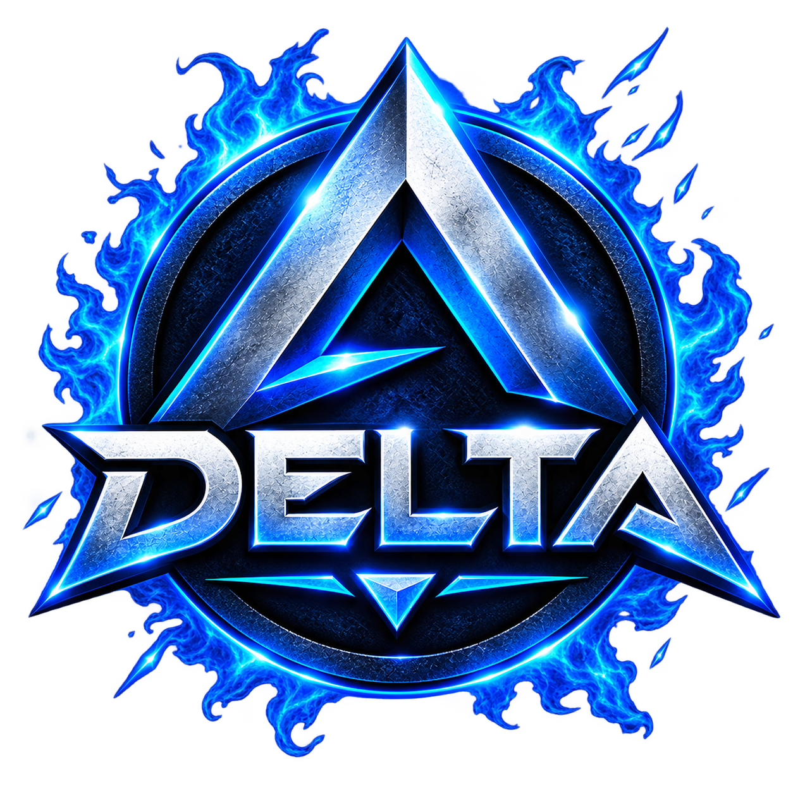

# ⚡ DELTA — Discord Quest Hunter

### Hunt Discord Quests • Complete Play Quests • Track Your Progress

**Powered by Eminene Tech Team**

---

## 🌌 About DELTA

DELTA is a modern Windows application built for **Discord Play Quests**. It helps users launch supported quest games, monitor quest sessions, manage multiple games, and keep track of overall playtime through a clean desktop interface.

Designed for speed, simplicity, and convenience.

---

## ✨ Features

### 🎯 Quest Hunter

Complete Discord Play Quests with a single click.

- Launch supported quest games instantly.
- Automatic Discord detectable game support.
- Start and stop quest sessions anytime.
- Multiple executable support for compatible games.

### 🎮 Game Library

A built-in library of Discord detectable games.

- Fast game search.
- Game icons and details.
- Executable selector.
- Recently played games saved automatically.

### ⏱ Smart Quest Timer

Every session includes a built-in countdown timer.

- Live remaining time.
- Automatic quest duration tracking.
- Manual stop whenever needed.

### 📋 Multi Quest Queue

Queue several games and let DELTA process them one by one.

- Add multiple games.
- Skip queued entries.
- Remove items from queue.
- Automatic queue progression.

### 📊 Statistics

View your complete quest history.

- Total playtime.
- Total launches.
- Most played games.
- Recently completed quests.
- Per-game activity history.

### 🎨 Custom Themes

Switch the appearance anytime.

- Dark
- AMOLED
- Violet

### 🔊 Extra Experience

Small quality-of-life features included.

- Start/stop sound effects.
- Minimize to system tray.
- Automatic update notifications.

---

## 📈 Activity Tracking

DELTA automatically records your quest activity locally.

| Tracking | Available |
|----------|-----------|
| Playtime History | ✅ |
| Launch Count | ✅ |
| Last Played Date | ✅ |
| Favorite Games | ✅ |
| Executable History | ✅ |

---

## 🛡 Built-in Protection

DELTA includes security features to protect the application and license system.

- Hardware-based license verification.
- Secure license activation.
- Integrity validation.
- Protected local configuration.
- Update verification system.

---

## 💜 Why DELTA?

- Clean and modern desktop interface.
- Lightweight performance.
- Fast game detection.
- Organized quest management.
- Built specifically for Discord Play Quests.

---

## 🧩 Version

| Information | Value |
|-------------|-------|
| **Application** | DELTA — Discord Quest Hunter |
| **Version** | v1.0.0 |
| **Platform** | Windows Desktop |
| **Developer** | Eminene Tech Team |

---

## ❤️ Credits

**DELTA — Discord Quest Hunter**

Developed and maintained by **Eminene Tech Team**.

Made for the Discord quest community with a focus on a fast, simple, and premium user experience.
